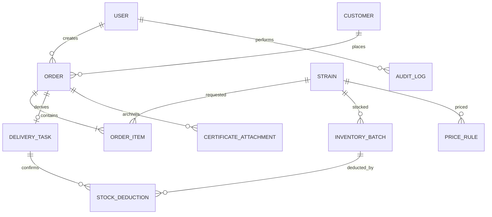
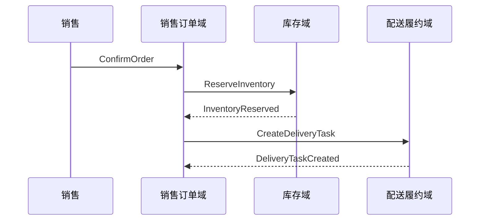
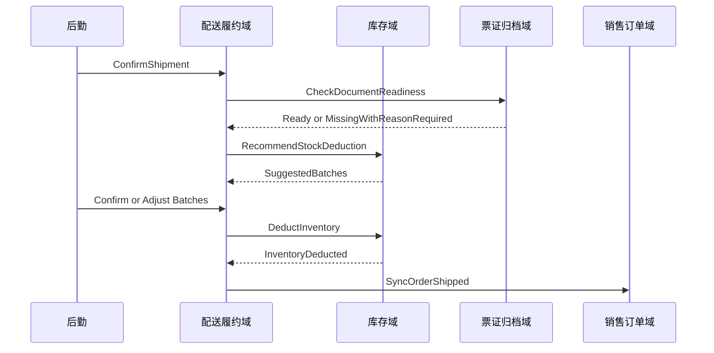
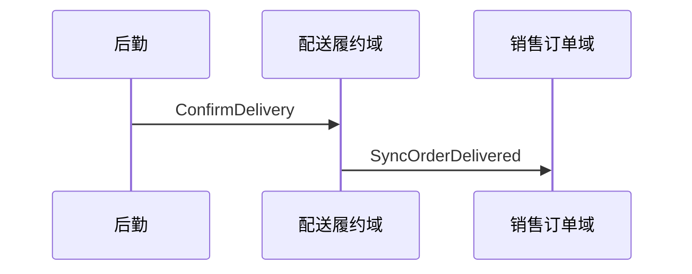

# 实验动物销售管理系统 — 框架结构与数据流通协议

> 版本: v0.1  
> 状态: MVP 框架草案  
> 依据: [prd.md](../product/prd.md)、[data-model.md](./data-model.md)、[CONTEXT.md](../domain/CONTEXT.md)  
> 关联: [api-contract.md](./api-contract.md)、[ADR Index](../adr/README.md)、[backend-blueprint.md](./backend-blueprint.md)、[persistence-migration-policy.md](./persistence-migration-policy.md)、[tdd-scaffold-plan.md](./tdd-scaffold-plan.md)  
> 说明: 本文件定义业务域边界、板块职责、角色权限和跨域数据流协议；不定义具体代码实现。

---

## 1. 框架原则

### 1.1 按业务域划分，不按页面菜单划分

系统框架按业务能力拆分为若干业务域。页面菜单可以组合多个业务域的数据，但业务域必须明确自己的数据所有权、可写边界和对外协议。

### 1.2 销售与后勤一期分离

MVP 中销售板块和后勤板块完全分开：

- 销售负责客户档案、报价、订单、改价、票证信息、回款标记。
- 后勤负责配送任务、车辆司机安排、出库确认、送达确认和需销售处理标记。
- 两者通过订单状态和配送任务状态同步，不互相修改对方领域内的数据。

### 1.3 客户基础档案不做销售隔离

客户档案对销售、后勤、管理员均可见。这样支持销售之间互相顶替，适应请假、生病、临时缺位等实际运营情况。

但业务动作仍需记录责任人：订单创建人、改价人、出库确认人、回款标记人等都必须可追溯。

### 1.4 核心流程用命令/事件，基础资料用 CRUD

- 基础资料使用 CRUD 协议：客户档案、联系人、地址、品系、价格表、常用资料。
- 核心业务流使用命令/事件协议：订单确认、库存预占、配送任务生成、出库扣减、票证弱校验、状态同步。

### 1.5 MVP 轻审计

MVP 只审计不可悄悄发生的高风险动作，不做全字段审计。

必须审计：订单改价、订单取消、订单关键状态变化、确认送达、需销售处理标记、库存入库、出库扣减、人工调整出库批次、票证缺失放行、价格表变更、客户送货地址变更。

---

## 2. 角色边界

| 角色 | 定位 | 可写范围 | 只读范围 | 不可做 |
| --- | --- | --- | --- | --- |
| 销售 | 负责客户沟通、报价、下单和回款跟进 | 客户档案、订单、订单明细、改价、票证信息、回款标记 | 库存、配送任务状态、价格表 | 修改配送安排、确认出库、确认送达 |
| 后勤 | 负责配送履约 | 配送任务、车辆、司机、配送批次、路线备注、出库确认、送达确认、需销售处理标记 | 客户基础档案、订单履约信息、票证准备状态、库存扣减建议 | 修改客户档案、订单价格、订单明细、结算方式、发票类型 |
| 管理员 | 负责全局配置和管理 | 用户、价格表、基础配置、必要时代操作 | 全部数据 | 无业务外特殊限制，但关键操作仍审计 |

---

## 3. 业务域划分

### 3.1 身份权限域

**职责**:

- 用户登录
- 角色识别
- 权限判断
- 操作人记录

**拥有数据**:

- 用户账号
- 用户角色: `sales` / `logistics` / `manager`
- 用户状态

**对外提供**:

- 当前登录用户
- 当前用户角色
- 当前用户是否允许执行某命令

**不负责**:

- 业务数据归属
- 业务状态流转
- 审计内容解释

---

### 3.2 客户档案域

**职责**:

- 维护客户基础档案
- 维护联系人
- 维护送货地址和开票地址
- 维护地理区域
- 维护结算方式和默认开票类型

**拥有数据**:

- 客户
- 联系人
- 地址
- 地理区域字段
- 默认送货方式
- 默认发票类型
- 结算方式

**可写角色**:

- 销售
- 管理员

**可读角色**:

- 销售
- 后勤
- 管理员

**边界规则**:

- 客户档案不按销售隔离。
- 地理区域是后勤安排车辆和编排路线的参考信息，不是自动路线规则。
- 客户送货地址变更必须进入轻审计。

**不负责**:

- 自动派车
- 自动路线优化
- 销售权限隔离
- 订单价格

---

### 3.3 商品与价格域

**职责**:

- 维护品类
- 维护品系
- 维护价格表
- 根据品系和周龄返回当前有效价格

**拥有数据**:

- 品类: 小鼠、大鼠、豚鼠、兔子
- 等级: 大小鼠为 SPF 级，豚鼠/兔子为普通级
- 品系
- 价格表
- 价格生效日期

**可写角色**:

- 管理员

**可读角色**:

- 销售
- 管理员

**边界规则**:

- MVP 定价维度为品系 + 周龄。
- 雌雄同价。
- 体重、阶梯价、预存款客户转人工。
- 价格表变更必须进入轻审计。

**不负责**:

- 订单实际成交价的最终解释。订单实际成交价由销售订单域保存。
- 配送策略提示产生的加量建议。

---

### 3.4 库存域

**职责**:

- 维护库存批次
- 计算当前周龄
- 计算可售数量
- 老化提醒
- 库存预占
- 出库扣减

**拥有数据**:

- 库存批次
- 出生日期
- 性别
- 初始数量
- 预占数量
- 预占分配记录
- 出库扣减记录
- 入库记录

**可写角色**:

- 销售: 入库录入
- 后勤: 出库扣减确认
- 管理员: 必要时调整

**可读角色**:

- 销售
- 后勤
- 管理员

**边界规则**:

- 周龄根据出生日期动态计算。
- 订单确认时按品系、周龄、性别、数量做销售语义上的汇总预占；系统内部可用 `reservation_allocations` 记录预占分配，用于取消或出库 finalize 时精确维护 `reserved_qty`。
- 出库时系统按优先老化/先进先出推荐扣减批次，后勤确认或调整后生效。
- `initial_qty` 为入库原始数量，不在出库时递减；真实出库事实由 `stock_deductions` 表达。
- 可售量统一为 `initial_qty - reserved_qty - stock_deduction_sum`。
- 人工调整出库批次必须进入轻审计。

**不负责**:

- 动物房繁育排期
- 路线配送
- 订单定价

---

### 3.5 销售订单域

**职责**:

- 创建订单
- 维护订单明细
- 订单确认
- 订单取消
- 人工改价
- 保存实际成交价
- 管理订单主生命周期

**拥有数据**:

- 订单
- 订单明细
- 订单编号
- 订单状态
- 实际单价
- 订单总额
- 订单销售责任人

**可写角色**:

- 销售
- 管理员

**可读角色**:

- 销售
- 后勤: 只读履约所需字段
- 管理员

**订单状态**:

| 状态 | 含义 | 推动方 |
| --- | --- | --- |
| `pending` | 待确认 | 销售 |
| `confirmed` | 已确认，库存已预占 | 销售 |
| `shipped` | 已出库，库存已扣减 | 配送任务同步 |
| `delivered` | 已送达 | 配送任务同步 |
| `invoiced` | 已开票/票证已归档 | 销售 |
| `settled` | 已结算 | 销售或管理员 |
| `cancelled` | 已取消 | 销售或管理员 |

**边界规则**:

- 订单确认后自动生成配送任务。
- 所有销售都可以修改未出库、未结算订单价格，但必须填写原因并进入轻审计。
- 已结算订单禁止改价。
- 后勤不能修改订单价格、订单明细、结算方式、发票类型。

**不负责**:

- 车辆司机安排
- 出库批次最终确认
- 自动路线优化

---

### 3.6 配送履约域

**职责**:

- 接收订单派生出的配送任务
- 安排配送日期、车辆、司机、配送批次和路线备注
- 标记需销售处理
- 确认出库
- 确认送达
- 推动订单状态同步

**拥有数据**:

- 配送任务
- 配送任务状态
- 配送日期
- 车辆
- 司机
- 配送批次
- 路线备注
- 需销售处理标记

**可写角色**:

- 后勤
- 管理员

**可读角色**:

- 销售
- 后勤
- 管理员

**配送任务状态**:

| 状态 | 含义 | 同步动作 |
| --- | --- | --- |
| `pending_schedule` | 待安排 | 订单确认后自动生成 |
| `scheduled` | 已安排车辆/司机/配送批次 | 不改变订单状态 |
| `shipped` | 已出库 | 同步订单为 `shipped`，执行出库扣减 |
| `delivered` | 已送达 | 同步订单为 `delivered` |
| `cancelled` | 已取消 | 订单取消且未出库时同步取消 |

**边界规则**:

- MVP 不做后勤接单，配送任务自动进入待安排。
- 二期再增加 `待接单` 和后勤负责人。
- 后勤发现地址、数量、票证、客户信息等问题时，只能标记“需销售处理”并填写说明。
- 后勤确认出库前必须处理库存扣减建议和票证弱校验提示。

**不负责**:

- 订单定价
- 客户档案维护
- 发票类型维护
- 回款结算

---

### 3.7 票证归档域

**职责**:

- 记录合格证附件
- 记录发票登记信息
- 判断出库时票证准备状态
- 执行票证弱校验

**拥有数据**:

- 合格证附件
- 发票是否需要
- 发票类型
- 发票登记状态
- 票证缺失放行原因

**可写角色**:

- 销售
- 管理员
- 后勤: 仅可在出库时填写票证缺失放行原因

**可读角色**:

- 销售
- 后勤
- 管理员

**边界规则**:

- 合格证由官方系统开具，本系统只上传和归档附件。
- 发票按客户需要提前确定，随货交付。
- MVP 采用弱校验：票证未准备完成时允许出库，但必须提示、填写原因并进入轻审计。

**不负责**:

- 官方合格证生成
- 税务发票开具系统对接

---

### 3.8 配送策略提示域

**职责**:

- 根据订单金额、数量、客户地理区域等条件给销售展示加量沟通建议
- 提示是否接近免纸箱运费条件

**拥有数据**:

- 策略名称
- 适用条件
- 满额阈值
- 满量阈值
- 适用区域
- 提示文案
- 是否启用

**可写角色**:

- 管理员

**可读角色**:

- 销售
- 管理员

**边界规则**:

- MVP 只输出销售提示，不自动改变订单总价。
- 不参与发票金额和对账金额计算。
- 不自动生成优惠。

**不负责**:

- 自动计价
- 自动折扣
- 结算对账

---

### 3.9 审计与导出域

**职责**:

- 记录轻审计动作
- 支持订单 Excel 导出
- 支持后续本地备份

**拥有数据**:

- 审计日志
- 导出记录，若后续需要

**边界规则**:

- MVP 不做全字段审计。
- 普通查看、搜索、备注、车辆司机路线备注修改不进入核心审计。
- 轻审计记录必须包含操作人、时间、对象、动作、改前值、改后值和原因；没有改前改后时记录动作结果。

---

### 3.10 结算分析域（二期）

**职责**:

- 月结对账
- 应收款看板
- 逾期提醒
- 客户排名和复购分析

**MVP 边界**:

- MVP 只保留结算方式、账期和订单结算状态。
- 不实现自动对账、账单生成和复杂应收款管理。

---

## 4. 关键对象关系



说明：

- `ORDER` 是销售主对象。
- `DELIVERY_TASK` 是后勤主对象，由订单确认后派生。
- `INVENTORY_BATCH` 不在订单确认时绑定；出库时通过 `STOCK_DEDUCTION` 确认实际扣减批次。
- `CERTIFICATE_ATTACHMENT` 只归档合格证文件，不生成官方合格证。

---

## 5. 数据流通协议总览

### 5.1 协议格式

核心命令建议按以下结构描述：

| 字段 | 含义 |
| --- | --- |
| 命令 | 用户或系统发起的业务动作 |
| 发起方 | 哪个角色或系统过程发起 |
| 读取 | 命令需要读取哪些业务域数据 |
| 写入 | 命令会修改哪些业务域数据 |
| 事件 | 命令成功后形成的业务事实 |
| 失败处理 | 失败时如何提示或回滚 |
| 审计 | 是否进入轻审计 |

### 5.2 普通资料 CRUD 协议

适用对象：客户档案、联系人、地址、地理区域字段、品系、价格表、常用资料。

| 动作 | 规则 |
| --- | --- |
| 创建 | 校验必填字段，保存创建人和创建时间 |
| 查看 | 按角色展示字段；客户档案不做销售隔离 |
| 更新 | 校验字段合法性，保存更新时间；高风险字段进入轻审计 |
| 停用 | 优先软删除或停用，不物理删除历史业务数据 |

---

## 6. 核心命令/事件协议

### 6.1 创建订单

| 项 | 内容 |
| --- | --- |
| 命令 | `CreateOrder` |
| 发起方 | 销售 / 管理员 |
| 读取 | 客户档案、默认送货方式、默认发票类型、价格表、可售库存汇总、配送策略提示 |
| 写入 | 订单、订单明细、实际单价、订单总额 |
| 事件 | `OrderCreated` |
| 失败处理 | 客户不存在、价格缺失、库存不足时阻止创建或提示转人工 |
| 审计 | 不进入轻审计，订单创建时间和创建人保存在订单中 |

规则：

- 创建时订单状态为 `pending`。
- 系统带出当前有效价，销售可修改实际单价。
- 创建阶段不预占库存。
- 配送策略提示只显示建议，不改变订单金额。

---

### 6.2 确认订单

| 项 | 内容 |
| --- | --- |
| 命令 | `ConfirmOrder` |
| 发起方 | 销售 / 管理员 |
| 读取 | 订单、订单明细、可售库存汇总 |
| 写入 | 订单状态、轻审计、库存预占分配、配送任务 |
| 事件 | `OrderConfirmed`、`InventoryReserved`、`DeliveryTaskCreated` |
| 失败处理 | 可售库存不足时阻止确认；已取消/已确认订单不能重复确认 |
| 审计 | 进入轻审计 |

规则：

- 按品系、周龄、性别、数量做汇总预占。
- 对销售订单不暴露具体库存批次；内部 `reservation_allocations` 仅用于精确释放/清理预占。
- 确认成功后自动生成 1 个配送任务，状态为 `pending_schedule`。

---

### 6.3 修改订单价格

| 项 | 内容 |
| --- | --- |
| 命令 | `ChangeOrderPrice` |
| 发起方 | 销售 / 管理员 |
| 读取 | 订单、订单明细 |
| 写入 | 订单明细实际单价、订单总额 |
| 事件 | `OrderPriceChanged` |
| 失败处理 | 已出库、已结算订单禁止改价；未填写原因禁止提交 |
| 审计 | 进入轻审计，记录改前价、改后价、原因 |

规则：

- MVP 中所有销售可改价。
- 改价不是审批流。
- 配送策略提示不能直接触发改价，只能辅助销售沟通。

---

### 6.4 取消订单

| 项 | 内容 |
| --- | --- |
| 命令 | `CancelOrder` |
| 发起方 | 销售 / 管理员 |
| 读取 | 订单、配送任务、库存预占 |
| 写入 | 订单状态、配送任务状态、库存预占分配释放 |
| 事件 | `OrderCancelled`、`InventoryReservationReleased`、`DeliveryTaskCancelled` |
| 失败处理 | 已出库订单原则上不允许直接取消，转人工处理 |
| 审计 | 进入轻审计，记录取消原因 |

规则：

- 订单未出库时取消，按 `reservation_allocations` 精确释放库存预占。
- 若已生成配送任务且未出库，同步取消配送任务。
- 已出库后的退货/冲正不纳入 MVP。

---

### 6.5 安排配送任务

| 项 | 内容 |
| --- | --- |
| 命令 | `ScheduleDeliveryTask` |
| 发起方 | 后勤 / 管理员 |
| 读取 | 配送任务、订单履约信息、客户送货地址、地理区域、票证准备状态 |
| 写入 | 配送日期、车辆、司机、配送批次、路线备注、配送任务状态 |
| 事件 | `DeliveryTaskScheduled` |
| 失败处理 | 配送任务不存在或已取消时阻止 |
| 审计 | 不进入轻审计 |

规则：

- 地理区域只作为后勤判断片区的参考。
- MVP 不做自动路线优化。
- 车辆、司机、路线备注修改不进入轻审计。

---

### 6.6 标记需销售处理

| 项 | 内容 |
| --- | --- |
| 命令 | `FlagSalesActionRequired` |
| 发起方 | 后勤 / 管理员 |
| 读取 | 配送任务、订单履约信息 |
| 写入 | 需销售处理标记、问题说明 |
| 事件 | `SalesActionRequiredFlagged` |
| 失败处理 | 已送达或已取消的配送任务不可新增标记 |
| 审计 | 进入轻审计，`reason` 记录问题说明 |

规则：

- 适用问题：地址疑问、数量疑问、票证疑问、客户信息不完整。
- 后勤不能直接修改销售域数据。
- 销售处理后可清除标记并备注处理结果。

---

### 6.7 确认出库

| 项 | 内容 |
| --- | --- |
| 命令 | `ConfirmShipment` |
| 发起方 | 后勤 / 管理员 |
| 读取 | 配送任务、订单明细、库存预占、库存批次、票证准备状态 |
| 写入 | `stock_deductions`、库存预占 finalize、配送任务状态、订单状态、票证放行原因 |
| 事件 | `ShipmentConfirmed`、`InventoryDeducted`、`OrderShipped` |
| 失败处理 | 库存不足或扣减批次不满足时阻止；票证缺失时弱校验放行 |
| 审计 | 进入轻审计 |

规则：

- 系统推荐扣减批次，后勤确认或调整后生效；实际扣减批次以 `stock_deductions` 为准。
- 出库成功后 finalize 对应订单明细的预占 allocation，递减 `reserved_qty` 并删除 allocation。
- 扣减成功后配送任务变为 `shipped`，订单同步为 `shipped`。
- 合格证或发票信息缺失时，系统提示并要求填写放行原因；允许继续。
- 票证缺失放行原因进入轻审计。

---

### 6.8 确认送达

| 项 | 内容 |
| --- | --- |
| 命令 | `ConfirmDelivery` |
| 发起方 | 后勤 / 管理员 |
| 读取 | 配送任务、订单 |
| 写入 | 配送任务状态、订单状态、送达时间 |
| 事件 | `DeliveryConfirmed`、`OrderDelivered` |
| 失败处理 | 未出库任务不能直接送达 |
| 审计 | 进入轻审计，记录状态变化即可 |

规则：

- 配送任务变为 `delivered` 后，订单同步为 `delivered`。
- 送达后订单进入票证归档、开票登记、回款跟进阶段。

---

### 6.9 登记票证归档

| 项 | 内容 |
| --- | --- |
| 命令 | `ArchiveOrderDocuments` |
| 发起方 | 销售 / 管理员 |
| 读取 | 订单、客户开票设置、合格证附件 |
| 写入 | 合格证附件、发票登记信息、订单状态 |
| 事件 | `OrderDocumentsArchived`、`OrderInvoiced` |
| 失败处理 | 文件缺失或格式不合法时阻止上传 |
| 审计 | 通常不进入轻审计；票证缺失放行已在出库时审计 |

规则：

- 合格证由官方系统开具，本系统只归档。
- 需要发票的订单登记发票信息。
- 完成后订单可进入 `invoiced`。

---

### 6.10 标记结算

| 项 | 内容 |
| --- | --- |
| 命令 | `SettleOrder` |
| 发起方 | 销售 / 管理员 |
| 读取 | 订单、结算方式 |
| 写入 | 订单状态、回款信息 |
| 事件 | `OrderSettled` |
| 失败处理 | 未送达或已取消订单不能结算 |
| 审计 | 进入轻审计，记录状态变化 |

规则：

- MVP 只做订单级结算状态。
- 月结对账单和应收款看板为二期。

---

## 7. 核心流程数据流

### 7.1 销售到后勤



边界：

- 销售确认订单后，不直接安排车辆。
- 配送任务由系统自动生成。
- 后勤从配送任务列表开始处理。

### 7.2 后勤出库到库存扣减



边界：

- 后勤确认出库是库存真实扣减入口。
- 票证缺失不阻断出库，但必须填写原因。
- 库存扣减必须基于后勤确认后的批次。

### 7.3 后勤送达到订单送达



边界：

- 后勤只同步送达事实。
- 后勤不处理回款、开票归档状态。

---

## 8. 权限矩阵

| 对象/动作 | 销售 | 后勤 | 管理员 |
| --- | --- | --- | --- |
| 查看客户档案 | 是 | 是 | 是 |
| 编辑客户档案 | 是 | 否 | 是 |
| 修改送货地址 | 是，审计 | 否 | 是，审计 |
| 查看库存 | 是 | 是 | 是 |
| 入库录入 | 是 | 否 | 是 |
| 创建订单 | 是 | 否 | 是 |
| 确认订单 | 是 | 否 | 是 |
| 修改订单价格 | 是，需原因 | 否 | 是，需原因 |
| 修改订单明细 | 是 | 否 | 是 |
| 查看配送任务 | 是 | 是 | 是 |
| 安排车辆/司机 | 否 | 是 | 是 |
| 标记需销售处理 | 否 | 是 | 是 |
| 确认出库 | 否 | 是 | 是 |
| 确认送达 | 否 | 是 | 是 |
| 上传合格证附件 | 是 | 否 | 是 |
| 票证缺失放行原因 | 否 | 是 | 是 |
| 标记结算 | 是 | 否 | 是 |
| 管理价格表 | 否 | 否 | 是 |

---

## 9. MVP 数据对象补充建议

现有 [data-model.md](./data-model.md) 需要根据本框架补充或调整以下对象。

### 9.1 users.role

角色建议扩展为：

```text
sales      销售
logistics  后勤
manager    管理员
```

### 9.2 customers

建议补充：

| 字段 | 含义 |
| --- | --- |
| `geo_area` | 地理区域，供后勤调度参考 |
| `primary_sales_rep_id` | 主要跟进销售，可为空或可变更；不用于客户可见性隔离 |

说明：

- 删除或弱化“销售只能看自己客户”的隔离规则。
- 客户档案所有销售、后勤、管理员可读。

### 9.3 delivery_tasks

MVP 建议新增配送任务对象。

| 字段 | 含义 |
| --- | --- |
| `id` | 配送任务 ID |
| `order_id` | 来源订单 |
| `status` | `pending_schedule` / `scheduled` / `shipped` / `delivered` / `cancelled` |
| `planned_delivery_date` | 计划配送日期 |
| `vehicle` | 车辆信息 |
| `driver` | 司机信息 |
| `delivery_batch` | 配送批次 |
| `route_notes` | 路线备注 |
| `sales_action_required` | 是否需销售处理 |
| `sales_action_note` | 问题说明 |
| `shipped_at` | 出库时间 |
| `delivered_at` | 送达时间 |

### 9.4 stock_deductions

建议记录出库时实际扣减批次。

| 字段 | 含义 |
| --- | --- |
| `delivery_task_id` | 配送任务 |
| `order_item_id` | 订单明细 |
| `inventory_batch_id` | 实际扣减库存批次 |
| `quantity` | 扣减数量 |
| `confirmed_by` | 后勤确认人 |
| `created_at` | 扣减时间 |

### 9.5 reservation_allocations

记录订单确认时内部预占分配，用于取消订单时释放预占，以及确认出库成功后 finalize 预占。它不是实际出库批次，实际扣减仍以 `stock_deductions` 为准。

| 字段 | 含义 |
| --- | --- |
| `order_item_id` | 被预占的订单明细 |
| `inventory_batch_id` | 预占对应库存批次 |
| `quantity` | 预占数量 |
| `created_at` | 创建时间 |

### 9.6 delivery_strategy_rules

MVP 仅作为销售提示规则，不参与计价。

| 字段 | 含义 |
| --- | --- |
| `name` | 策略名称 |
| `geo_area` | 适用地理区域，可为空 |
| `amount_threshold` | 满额阈值，可为空 |
| `quantity_threshold` | 满量阈值，可为空 |
| `suggestion_text` | 提示文案 |
| `is_active` | 是否启用 |

### 9.7 document_release_reasons

票证缺失仍出库时记录原因。

| 字段 | 含义 |
| --- | --- |
| `delivery_task_id` | 配送任务 |
| `order_id` | 订单 |
| `missing_certificate` | 是否缺合格证附件 |
| `missing_invoice` | 是否缺发票登记 |
| `reason` | 放行原因 |
| `released_by` | 放行人 |
| `created_at` | 放行时间 |

---

## 10. MVP 与二期边界

### 10.1 MVP 必做

- 用户登录和角色权限
- 客户档案共享查看
- 客户地理区域字段
- 品类、品系、价格表
- 库存批次、周龄动态计算、老化提醒
- 订单创建、确认、取消、改价
- 汇总库存预占
- 配送任务自动生成
- 后勤配送安排
- 系统推荐出库批次，后勤确认扣减
- 票证弱校验
- 订单和配送任务状态同步
- 轻审计
- 订单 Excel 导出

### 10.2 MVP 不做

- 销售客户隔离
- 自动路线优化
- 后勤接单和负责人
- 自动纸箱运费计价
- 自动折扣
- 官方合格证生成
- 税务发票系统对接
- 月结对账单自动生成
- 应收款看板
- 动物房繁育排期
- 退货/冲正完整流程

### 10.3 二期候选

- 后勤接单: `待接单 → 待安排`
- 配送任务负责人
- 多订单合并配送批次
- 月结对账单
- 应收款逾期提醒
- 统计看板
- 本地备份策略
- 更细审计范围
- 复杂业务转接

---

## 11. 待确认事项

| # | 事项 | 影响 |
| --- | --- | --- |
| 1 | 品系价目表 | 影响价格表初始化和订单报价 |
| 2 | 品系清单 | 影响库存和价格基础数据 |
| 3 | 地理区域划分口径 | 影响客户档案和后勤调度筛选 |
| 4 | 纸箱运费提示策略阈值 | 影响配送策略提示规则 |
| 5 | 入库细节是否需要笼位号 | 影响库存批次字段 |
| 6 | 月结细则 | 影响二期结算分析域 |
| 7 | 出库批次确认操作负担 | 影响 MVP 是否保持“系统推荐，后勤确认” |

---

## 12. 与旧文档的差异说明

以下决策以本框架为准，后续可回写到 PRD 和数据模型：

- 客户基础档案不做销售隔离。
- MVP 增加后勤角色。
- MVP 增加配送任务域，订单确认后自动派生配送任务。
- 后勤在配送任务中确认出库，并触发库存扣减和订单状态同步。
- 地理区域是后勤调度参考信息，不是自动路线规则。
- 配送策略提示不参与自动计价。
- 审计采用轻审计，不做全字段审计。
